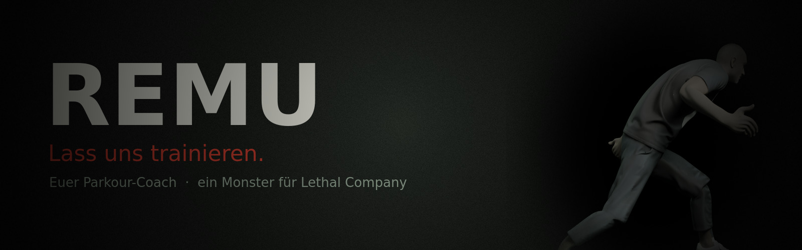

  <b>Euer Parkour-Coach ist da. Er hat ein Trainingsprogramm für euch.</b> 
  Ein Monster für Lethal Company – was er tut, findet ihr selbst heraus.

  
  
  
  
  

---

## Installation (einmalig, ca. 2 Minuten)

> Du brauchst **r2modman** und ein Profil für Lethal Company.

| Schritt | |
|---|---|
| **1. Herunterladen** | Rechts unter **Releases** bei der neuesten Version die Datei **`Remu-v….zip`** laden. |
| **2. r2modman öffnen** | Dein Lethal-Company-Profil wählen. |
| **3. Importieren** | **Settings** → Reiter **Profile** → **Import local mod** → Zip auswählen → bestätigen. |
| **4. Abhängigkeiten** | Fragt r2modman nach **BepInExPack** oder **LethalLib**: installieren lassen. |
| **5. Spielen** | **Start modded**. |

## Updates

**Laufen automatisch.** Beim Spielstart holt sich Remu neue Versionen selbst. Steht im Hauptmenü *„Remu wurde aktualisiert“*, das Spiel einmal schliessen und neu starten – sonst musst du nichts tun.

## Gut zu wissen

- **Alle in der Lobby** brauchen Remu in derselben Version (nach einem Update also alle einmal neu starten).
- **Kopfhörer** empfohlen.
- Geht etwas schief: die Zip aus den Releases einfach nochmal importieren.

---

Inoffizieller Mod · Lethal Company © Zeekerss

